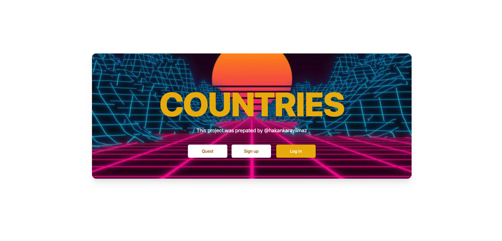
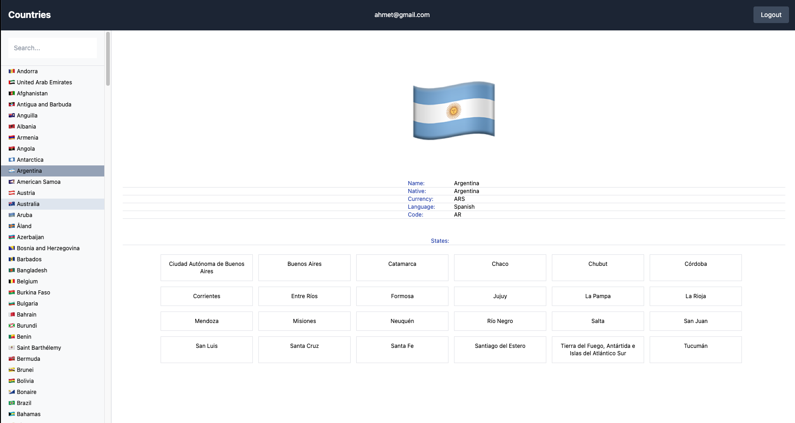

# Countries App

🔸 You can see all countries information. <br>
🔸 This web app built with using [Remix.js](https://remix.run/). <br>

Firstly, You should fork/download repo to your github/pc after than
open the app with VS Code and follow the below commands...

## 💻 Setup <br>

### Install Dependencies

```
npm install
```

### Run the App in the Dev Server

```
npm run dev
```

### to Build for Production

```
npm run build
```

## 🔥 Technologies and Libraries <br>

✔️ Remix.js <br>

## 🚀 App Features <br>

✔️ User can see can see all countries information. <br>
✔️ Auto Selected country depand on list lenght<br>
✔️ Optimistic UI<br>
✔️ Filter Bar <br>

## 📷 Screenshot <hr>


<br>

<br>
